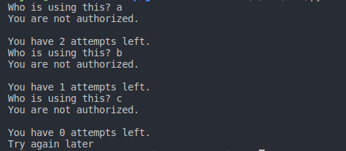
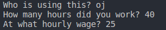
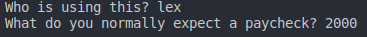
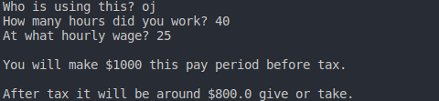
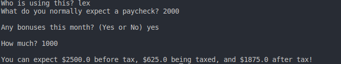
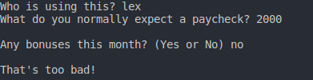

# Personal Pay Calculator

This is a personal pay calculator I developed, currently supporting only two users but can support more.

## Reason For This Project

I built this after learning about recursion, I wanted to build an application that could work for me in my day to day. So I built something that could better calculate our household income. 

## Getting Started

Upon launch of program you will be asked "Who is using this?" There you will have up to 3 attempts at entering a valid using. If the user is not stored then the program will exit and close.

:

Successfull entries into the program will output as such.

:

or for salaried workers: 

:

## Output

After successfully entering the system you will be asked a series of questions to better gauge what the paychecks will be. These are also taking in consideration specific taxes for my current location.

The following output after questions have been answered will look as such:

### For hourly workers

:

### For salaried employee

There are options, one for a bonus included:

:

No bonus: 

: